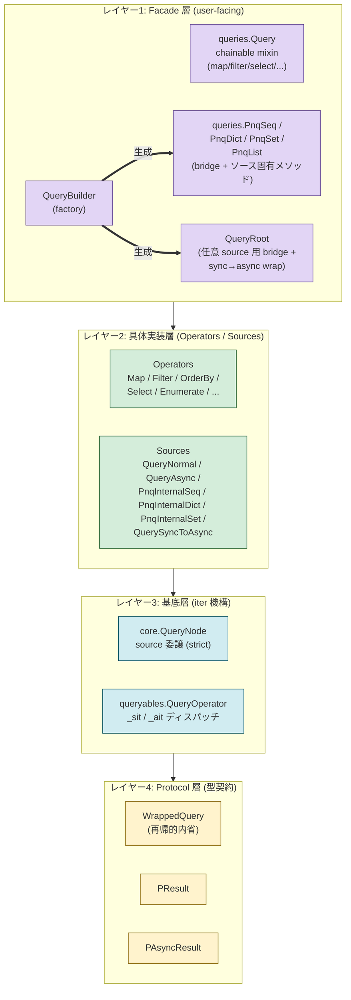
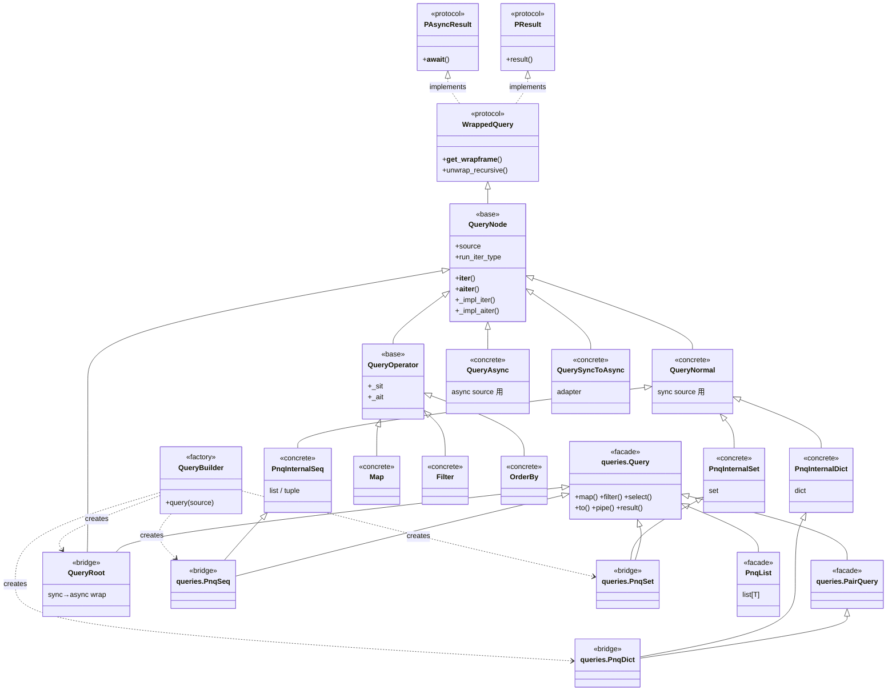

# 内部設計

## モジュール図

* モジュール
    * pnq/__queries__.py: queries.py 用のテンプレート。型アノテーションなど複雑な一貫性のためにテンプレート化している。
    * pnq/queries.py: __queries__ から生成された実際のコード。型アノテーションや内部オブジェクトとの連携を行う結合層。pnq/_itertools/queryables を参照する 
* クラス・ファンクション
    * pnq/queries.Query: 基本の型 (mixin: チェーン可能メソッドのみを提供。iter 機構は持たない)
    * pnq/queries.PairQuery: キーバリュー向けの型
    * pnq/queries.QueryRoot: list/dict/set 以外の任意 source 用の単一ブリッジ。Query (mixin) と core.QueryNode (iter 機構) を結合。__init__ で source の __iter__/__aiter__ を見て run_iter_type を自動セットし、sync-only source も async wrapping で両対応する。
    * pnq/pnq/protocols.WrappedQuery: クエリ構造の再帰的内省を提供するクラス
        * pnq/_itertools/core.QueryNode: WrappedQuery(PQuery)を継承。イテレータに関する基本的な実装が含まれる (strict: source の能力をそのまま反映)。
            * pnq/_itertools/queryables.QueryOperator: QueryNode を継承し、Map など具体的な演算子クエリの基底となる。`_ait`（非同期用イテレータクエリ）と `_sit`（同期用イテレータクエリ）の属性に演算子の処理関数への参照を埋める形で派生クラスを定義する。
    * pnq/_itertools
        * _async: 非同期用イテレータクエリ。queryables.Query から参照される
        * _sync_generate: 同期用イテレータクエリ。_async から自動生成される
        * _sync:  同期用イテレータクエリ。自動生成できない部分を管理する。queryables.Query から参照される
    * pnq/_itertools/generate_unasync.py: pnq/_itertools/_async から非同期コード（_sync_generate）を生成する。

## クラス関係図

### レイヤ構造 (役割別)

上から user-facing、下に向かって foundation。矢印は **依存方向** (上が下を利用 / 継承する)。



### 詳細継承関係

各クラスのステレオタイプ:
- `<<protocol>>`: 型契約 (interface)
- `<<base>>`: 抽象的な基底クラス
- `<<concrete>>`: 具体実装 (source / operator)
- `<<facade>>`: チェーン可能 API を提供する mixin
- `<<bridge>>`: 複数のクラスを結合する結合層
- `<<factory>>`: 生成役



### 設計の読み方

レイヤーは **上 (user-facing) → 下 (foundation)** で説明:

1. **レイヤー1: Facade 層** (`queries.*`):
   - `queries.Query` は **mixin**: チェーン可能メソッドのみを提供する純粋な mixin で、iter 機構は持たない。
   - `QueryRoot` 等の **bridge クラス**が Query (mixin) + core の具体実装を多重継承で結合。
   - `QueryBuilder` は source の型に応じて適切な bridge クラスを選んで生成する **factory**。

2. **レイヤー2: 具体実装層 (Operators / Sources)**:
   - **Sources** (`QueryNormal`/`QueryAsync`/`PnqInternalSeq`/`PnqInternalDict`/`PnqInternalSet`/`QuerySyncToAsync`): source の種類に応じた具体クラス。`QueryNode` の挙動を必要に応じて調整する。
   - **Operators** (`Map`/`Filter`/`OrderBy`/`Select`/...): `QueryOperator` を継承し、`_sit`/`_ait` に sync/async 実装関数の参照を埋める。**操作 1 つにつき 1 クラス**。

3. **レイヤー3: 基底層 (iter 機構)**:
   - `QueryNode`: iter_type 管理 + sync/async 振り分けの中核。**strict**(source の能力をそのまま反映)。
   - `QueryOperator`: `_sit`/`_ait` 属性に sync/async 実装関数の参照を埋める方式で演算子を表現する基底。

4. **レイヤー4: Protocol 層** (`WrappedQuery` / `PResult` / `PAsyncResult`):
   型契約のみ。`__get_wrapframe__` による再帰的内省、`result()`/`__await__()` といった終端契約を定義。

> 設計思想: 「**iter 機構は内部 (core) に閉じ込め、ユーザに見せる API はチェーン可能 mixin (queries.Query) のみ**」を徹底することで、内部実装の変更がユーザ API に波及しないようにしている。

## なぜ複雑か？

* 同期と非同期 Iterable を一緒に管理しようとしている
* 同期と非同期 Iterable の代わりに Pnq用の独自 Iterable があるとすっきりするのではないか
* 同期と非同期用の型アノテーションを一括で管理しようとしている
* 非同期コードから同期コードを自動生成している
* その他、整理が進んでいない

## リファクタリング計画

* [ ] Python のバージョンアップで無理やり解決していた型アノテーションをスマートな形に寄せる
* [x] queries.Query, core.Query, queryables.Query で Query クラスを別の名前で区別する。名前が被っているせいで混乱を招く
    * 空ブリッジ (queries.QueryBase / QueryAsync / QueryNormal) を `queries.QueryRoot` 1 つに集約
    * core.Query を `core.QueryNode` にリネーム (内省 + iter_type 管理を担う基底)
    * queryables.Query を `queryables.QueryOperator` にリネーム (Map 等の演算子の基底)
    * これにより `Query` という名前は user-facing の `queries.Query` (mixin) のみとなり衝突解消
* [x] Query は継承していたりするが、ネストを少なくする
    * 空ブリッジ 3 → 1 に集約 ([queries.py:1003](../pnq/queries.py#L1003))
    * Builder の QUERY_BOTH / QUERY_ASYNC / QUERY_NORMAL 3 つを `QUERY` 1 つに集約 ([builder.py](../pnq/_itertools/builder.py))
* [x] とにかく基底クラスを分かりやすくする
    * QueryRoot に「単一ブリッジ + iter_type 自動判定」を集約。役割が docstring で明示
* [ ] sleep などクエリと領域が違うものを除去する


## インターフェースの再整理

### api

```
# pipe は pandas 由来
# https://pandas.pydata.org/docs/reference/api/pandas.DataFrame.pipe.html

# pipe は全て await で実行とする。そうすることで同期イテレータも非同期イテレータも表現を統一できる
await pnq.query([1, 2, 3]).map(lambda x: x * 2).pipe(pnq.dispatcher)
await pnq.query([1, 2, 3]).map(lambda x: x * 2).pipe(pnq.list)

# これでは実体化されない。pipe はまだイテレータの一種。
pnq.query([1, 2, 3]).map(lambda x: x * 2).pipe(list)

# 実体化するには await するか、to を実行する
pnq.query([1, 2, 3]).map(lambda x: x * 2).pipe(list)()

# 下記は上記のシンタックスシュガー
pnq.query([1, 2, 3]).map(lambda x: x * 2).to(list)

list の代わりに別の関数など与えた場合、
それが非同期を想定しているか、同期を想定しているか判定できない。
引き数を判定できない。
常に非同期イテレータを受け取る想定で


計画
まず、async に寄せる！！！
そのあと同期への逃げ方を決める！！！

```

```
# pipe とほぼ同じ。ただし、結果を返さずに投げ捨てられ、メモリなどを効率的に使う
pnq.query([1, 2, 3]).map(lambda x: x * 2).pipe_each(myfunc)
```


```
await pnq.query([1, 2, 3]).map(lambda x: x * 2).pipe_async(pnq.dispatcher)
await pnq.query([1, 2, 3]).map(lambda x: x * 2).pipe_async(pnq.list)

await pnq.query([1, 2, 3]).map(lambda x: x * 2).pipe_sync(pnq.list)
await pnq.query([1, 2, 3]).map(lambda x: x * 2).pipe_sync(pnq.list)

# デフォルトで非同期・同期よしなにやってくれる
await pnq.query([1, 2, 3]).map(lambda x: x * 2).pipe(pnq.list)


# select は namedtuple にする(json 出力できる型にする)
await pnq.query([1, 2, 3]).select('id', 'fname', 'lname', 'phone').pipe(pnq.dispatcher)
await pnq.query([1, 2, 3]).select('id', 'fname', 'lname', 'phone').pipe(pnq.list)
await pnq.query([1, 2, 3]).select('id', 'fname', 'lname', 'phone').pipe(pnq.orderby)

await pnq.from_([1, 2, 3]).select('id', 'fname', 'lname', 'phone').pipe_sync(list)
await pnq.from_sync([1, 2, 3]).pipe_sync(list)
await pnq.from_async([1, 2, 3]).pipe_sync(list)
```


### pypika

```
q = Query.from_('customers').select('id', 'fname', 'lname', 'phone').orderby('id', order=Order.desc)
q.get_sql()

customers = Table('customers')
q = Query.from_(
    customers
).where(
    customers.lname == 'Mustermann'
).select(
    customers.id, customers.fname, customers.lname, customers.phone
)
```